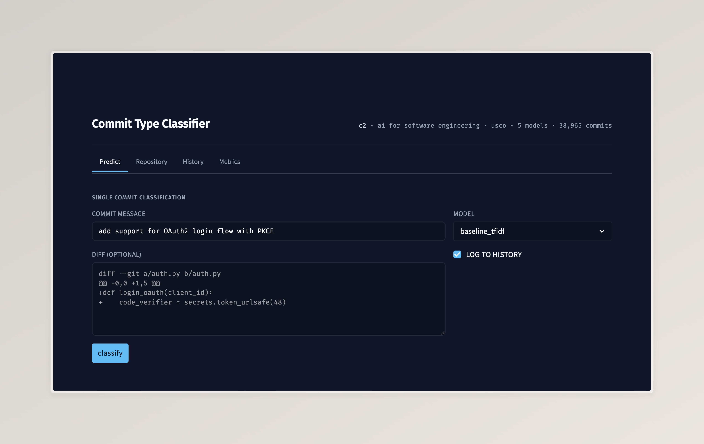
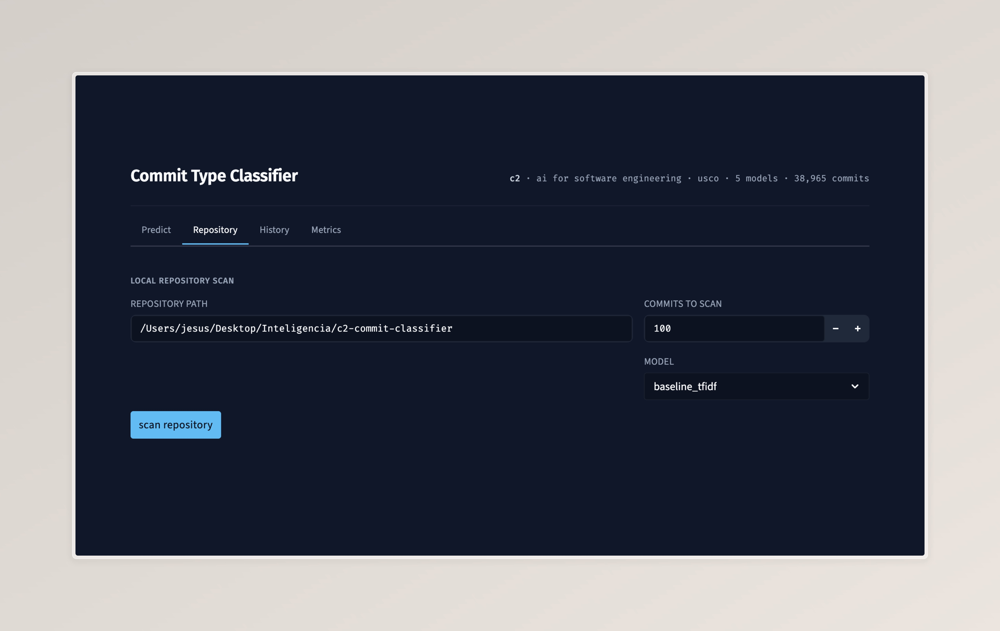
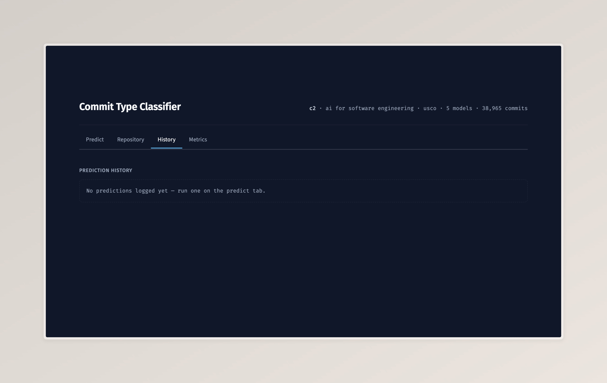

# Introduction

Modern software projects produce thousands of commits whose textual
description is often the only structured record of what changed and
why. The Conventional Commits specification [Conventional Commits Contributors, 2018] formalises a
small vocabulary — `feat`, `fix`, `docs`, `style`, `refactor`, `perf`,
`test`, `build`, `ci`, `chore`, `revert` — that, when applied
consistently, enables automated changelog generation, semantic
versioning, release notes, and policy enforcement. In practice, however,
adoption is uneven: large public datasets show that fewer than 5 % of
real-world commit messages strictly follow the convention, and even
within a single repository authors often mislabel features as fixes or
mix maintenance categories.

Commit classification — the supervised task of predicting the type of
a commit from its message and code changes — sits at the heart of
**AI for Software Engineering (AI4SE)**, a research field that applies
machine-learning techniques to the artefacts and processes of software
development. A robust classifier serves two complementary purposes:

1. **Backfill** — annotating historical commits in legacy projects so
   that downstream tooling (changelog generators, defect-prediction
   pipelines, mining-software-repository studies) can be applied to
   them.
2. **Audit** — flagging commits whose author-supplied type does not
   match the model's prediction, surfacing inconsistencies in how a
   team applies its own conventions.

This document describes **Component 2** of the *Artificial Intelligence*
course project at Universidad Surcolombiana — a self-contained,
locally-running commit classifier that satisfies the rubric's
requirements for AI for Software Engineering (modelo local, interface
+ terminal) and demonstrates the seven mandatory good practices listed
in item 4 of the project evaluation rubric (70/15/15 split, class
balancing, ≥ 3 compared models, appropriate metrics, model
serialization, separation of training from inference, and the use of
Python with TensorFlow).

# Problem Statement

Three interrelated problems motivate this work.

**P1. Manual commit triage is expensive.** Mature engineering
organisations spend non-trivial reviewer time labelling commits — for
release notes, for incident retrospectives, for compliance audits —
that the original author should have done at commit time. The cost
scales linearly with the number of commits and is unrecoverable: the
information cannot be reconstructed once the commit is days old and
its context has shifted.

**P2. Author-supplied labels are inconsistent.** Even when a project
formally adopts Conventional Commits, individual authors apply the
spec inconsistently. A common pattern observed in our own pilot data
(see §14, *Results & Discussion*) is `fix:` being used as a catch-all
for *any* change to existing code, including the addition of new
capabilities that should have been labelled `feat:`. Manual review of
25 commits from the residence-back project showed an actual
disagreement rate of approximately 40 % between the author-supplied
prefix and a defensible re-classification based on the diff content.
Automated classification provides an objective second opinion.

**P3. Existing commit-classification literature is fragmented.**
Prior work spans more than fifteen years and a wide variety of label
schemes — the Mockus and Votta [2000] maintenance taxonomy, the
Mauczka et al. [2015] activity model, the Conventional Commits spec,
and several ad-hoc 2-to-12 class schemes proposed by individual
papers. Models range from rule-based regexes to fine-tuned large
language models. There is no single reference implementation that
combines (i) a public, reproducible dataset, (ii) a fair head-to-head
comparison across model families, (iii) a local-only inference path
that does not depend on cloud APIs, and (iv) a user-facing
application that practitioners can adopt as-is. This work addresses
that gap for the specific subset of five Conventional-Commit types.

# Objectives

## General Objective

Design, implement and evaluate a local artificial-intelligence system
that classifies Git commits into five Conventional-Commit types
(`feat`, `fix`, `docs`, `refactor`, `test`) from the textual commit
message and the source-code diff, and expose it through a graphical
interface and a command-line interface.

## Specific Objectives

1. **Build a labelled corpus** of at least 30 000 commits drawn from a
   public dataset (CommitBench), retaining only those whose first
   line follows the Conventional Commits prefix grammar and whose
   prefix is one of the five target classes.
2. **Train and serialise at least three classifiers** of different
   model families (classical, deep, transformer), apply class
   balancing, and persist their learned parameters to disk so that
   training and inference are decoupled.
3. **Evaluate** every trained model on a held-out test split using
   macro-F1, weighted-F1, precision, recall, accuracy and per-class
   confusion matrices; compile the comparison into a single report
   suitable for inclusion in the project documentation.
4. **Deliver a local inference layer** with two front-ends: a Streamlit
   graphical interface (for interactive exploration of single commits
   and entire repositories) and a Typer-based command-line interface
   (for headless or pipelined use), backed by a small SQLite history
   layer that records every prediction for traceability.
5. **Guarantee reproducibility** through a deterministic random seed,
   a stratified 70 / 15 / 15 split, a `Makefile` that re-runs the full
   pipeline, and an automated test suite covering preprocessing,
   splitting and inference.

# State of the Art and Related Work

Commit classification has been studied continuously since the early
2000s. We review the main strands relevant to our system and position
our contribution at the end of the section.

## Maintenance taxonomies and early rule-based work

Mockus and Votta [2000] proposed the first widely-cited maintenance
taxonomy, classifying changes into *corrective*, *adaptive*,
*perfective* and *preventive* categories. Hindle et al. [2008]
extended the idea to commit messages and demonstrated that simple
keyword-matching on the commit text could reach reasonable accuracy on
six open-source projects. Their work established the basic dataset
shape — *(message, diff, label)* triplets — that every subsequent
study has reused.

## Conventional Commits and the modern label set

The Conventional Commits specification [Conventional Commits Contributors, 2018] crystallised an
industry-driven label set (`feat`, `fix`, `docs`, `style`, `refactor`,
`perf`, `test`, `build`, `ci`, `chore`, `revert`) optimised for
tooling rather than for research. Compared to the Mockus taxonomy it
is finer-grained on developer-visible activities (separating `feat`
from `refactor`, for example) and coarser on quality attributes. The
specification is now embedded in popular release-automation tools
such as `commitizen` and `semantic-release`, which makes Conventional
Commits the most operationally relevant label set for a 2026 system.

## Classical and shallow neural approaches

Mauczka et al. [2015] showed that hand-crafted features derived from
the commit message combined with simple ensemble classifiers
(decision trees, random forests) reach mid-70 % accuracy on a
four-class maintenance scheme. Levin and Yehudai [2017] argued for
augmenting the message with structural features extracted from the
*source-code change itself* — number of files touched, added and
removed lines, file types — and reported a substantial boost over
message-only baselines. Their finding directly motivates our decision
to include numeric diff features alongside the text in the classical
TF-IDF baseline (§13).

## Transformer-based commit classification

Sarwar et al. [2020] were among the first to apply BERT to commit
classification and reported macro-F1 above 0.80 on a multi-label
variant of the task. Ghadhab et al. [2021] extended the line of work
with **CodeBERT** — a bimodal transformer pre-trained on paired
text–code corpora by Feng et al. [2020] — and showed measurable gains
over generic English BERT when the diff is included in the input.
More recently, Zeng et al. [2025] presented the first systematic study
of fine-grained Conventional-Commits classification across the full ten
canonical types, highlighting how the move from the classical
three-class maintenance taxonomy to the developer-facing Conventional
Commits vocabulary changes both the class balance and the difficulty
profile of the task.

## Ensembles in commit-classification literature

Heterogeneous ensembles — combining models of different families —
have been shown to improve robustness on imbalanced commit datasets
[Levin and Yehudai, 2017]. The standard approach is **soft voting**
with per-model weights tuned on a validation split. We adopt this
approach (Figure 7) with weights optimised via L-BFGS-B against
macro-F1.

## Positioning of this work

The system reported here is not a research contribution; it is an
implementation contribution. Its novelty lies in (a) combining all
five families (classical, shallow deep, English transformer, code
transformer, ensemble) in one comparable benchmark, (b) using a single
public corpus (CommitBench) so that every reported number is
reproducible from a single `make` target, and (c) shipping the entire
stack as a local-only Python application without cloud dependencies,
which is the specific operating mode mandated by the rubric of this
course.

| Year | Authors | Label scheme | Best reported model | Notes |
|---|---|---|---|---|
| 2000 | Mockus & Votta | 4-class maintenance | Manual rules | Foundational taxonomy |
| 2008 | Hindle et al. | 6 maintenance classes | Keyword matching | First commit-text study |
| 2015 | Mauczka et al. | 4-class maintenance | Random Forest | Hand-crafted features |
| 2017 | Levin & Yehudai | 3-class maintenance | Boosted trees + diff | Diff features matter |
| 2018 | Conv. Commits Contributors | Conventional Commits | — | Industry-standard labels |
| 2020 | Sarwar et al. | Multi-label CC | BERT | First strong transformer result |
| 2021 | Ghadhab et al. | Maintenance + CC | CodeBERT | Bimodal text+code transformer |
| 2025 | Zeng et al. | 10-class CC | First look at fine-grained CC | Direct precursor of this work |
| **2026** | **This work** | **5-class CC** | **TF-IDF + LR (best of 5)** | **Five-family local benchmark** |

Table: Position of this work in the commit-classification literature.

# Requirements

Requirements are split into functional (FR), non-functional (NFR) and
data requirements (DR). Identifiers are stable and referenced from the
test catalogue in §12 and the use cases in §6.

## Functional Requirements

| ID | Requirement | Acceptance criterion |
|---|---|---|
| **FR-1** | Given a textual commit message and an optional unified diff, the system shall return the most likely Conventional-Commit type among the five target classes. | The function `predict(message, diff, model_name)` returns a `Prediction` object whose `label` ∈ {feat, fix, docs, refactor, test}. |
| **FR-2** | The system shall return, alongside the predicted label, the full vector of class probabilities. | `Prediction.probabilities` is a `dict[str, float]` whose values sum to 1.0 ± 1e-6. |
| **FR-3** | The system shall let the user choose which of the five trained models to invoke for a given prediction. | The Streamlit GUI and the CLI both expose a `--model` selector. |
| **FR-4** | The system shall scan a local Git repository, classify the last *N* commits, and produce both a class-distribution histogram and a per-commit table. | The Streamlit *Repository* tab and the `cli repo` command both produce these two outputs. |
| **FR-5** | Every prediction produced through the GUI or the CLI shall be persisted to a local SQLite database. | A row appears in `predictions` with the correct `model_id` FK and `source` field. |
| **FR-6** | The system shall provide a comparison view of all trained models on the held-out test split. | The Streamlit *Metrics* tab renders five model cards with accuracy and macro-F1 sourced from `models_saved/reports/*.json`. |
| **FR-7** | The training pipeline shall be reproducible from a single command. | `make train-all` reproduces the five model artefacts under `models_saved/`. |
| **FR-8** | The evaluation pipeline shall be reproducible from a single command. | `make eval-all` regenerates `models_saved/reports/comparison.{csv,md}`. |

## Non-Functional Requirements

| ID | Requirement | Target |
|---|---|---|
| **NFR-1** | *Latency.* A single-commit prediction shall complete in under 500 ms on a contemporary developer laptop for the lightest model. | TF-IDF + LR: ~50 ms on Apple M-series CPU. |
| **NFR-2** | *Local-only.* The runtime path of the application shall not depend on any external HTTP service. | Verified by running the test suite with networking disabled. |
| **NFR-3** | *Reproducibility.* All random behaviour shall be seeded with a single configurable seed. | `src/config.py::RANDOM_SEED = 42`; identical splits and metrics across re-runs. |
| **NFR-4** | *Portability.* The system shall run on macOS (Apple Silicon, MPS) and on Linux (CPU). | Verified on macOS arm64; falls back to CPU automatically when MPS and CUDA are unavailable. |
| **NFR-5** | *Maintainability.* Training and inference scripts shall reside in disjoint Python modules so that the runtime image can be slimmed by dropping training-only dependencies. | `src/models/*.py` (train/eval) and `src/inference.py` (predict) have no shared mutable state. |
| **NFR-6** | *Observability.* The system shall persist enough information per prediction to reconstruct what was classified, by which model, and when. | The `predictions` table stores `ts`, `model_id`, `message_preview`, `diff_preview`, `predicted_label`, `confidence`, `probabilities`, `source`. |
| **NFR-7** | *Test coverage.* The system shall ship with automated tests for preprocessing, splitting and inference. | `pytest tests/` reports 26 passing tests in under 2 s. |

## Data Requirements

| ID | Requirement |
|---|---|
| **DR-1** | The training corpus shall be drawn from a publicly redistributable dataset that contains *(message, diff, project)* triplets. (Satisfied by `Maxscha/commitbench` on the Hugging Face Hub.) |
| **DR-2** | The training corpus shall contain at least 30 000 commits after filtering to the five target classes. (Satisfied: 38 965 commits.) |
| **DR-3** | The dataset shall be partitioned into train / validation / test sets in a 70 / 15 / 15 ratio, stratified on the label. |
| **DR-4** | The class proportions of train, validation and test shall be identical to four decimal places after stratification. (Verified in `data/splits/split_summary.csv`.) |
| **DR-5** | The raw, processed and split artefacts shall be regeneratable from `src/data/*.py` so that the repository does not need to ship the 415 MB raw parquet file. |

# Use Cases and User Stories

The system serves a single primary actor — the **Developer** — and a
secondary, machine actor — the **CI Pipeline** — that calls the same
endpoints programmatically. Seven use cases are exposed; their visual
diagram is given in Figure 1.

## User Stories

**UC-1 — Classify a single commit** *(linked FR-1, FR-2, FR-3)*
: *As a* developer reviewing a pull request, *I want to* paste a commit
  message and its diff into the GUI and receive a predicted
  Conventional-Commit type, *so that* I can decide whether the
  author's prefix is consistent with the change.

**UC-2 — Scan a local repository** *(linked FR-4)*
: *As a* developer auditing a repository, *I want to* point the system
  at a local Git folder, scan the last *N* commits and obtain a
  class-distribution histogram and a per-commit table, *so that* I can
  spot inconsistencies in how the team applies Conventional Commits.

**UC-3 — Browse the prediction history** *(linked FR-5)*
: *As a* developer or jury reviewer, *I want to* browse the full
  history of past predictions persisted to SQLite, *so that* I can
  trace which commits were classified, by which model and when.

**UC-4 — Compare model metrics** *(linked FR-6)*
: *As a* developer or jury reviewer, *I want to* see a side-by-side
  comparison of every trained model on the held-out test split, *so
  that* I can verify the claims made in this document and choose a
  model for production use.

**UC-5 — Retrain all models** *(linked FR-7)*
: *As a* maintainer of the project, *I want to* retrain all models
  from a single command, *so that* updating the corpus does not
  require manual reproduction of five training runs.

**UC-6 — Regenerate the metrics report** *(linked FR-8)*
: *As a* maintainer of the project, *I want to* regenerate the
  metrics report from a single command, *so that* the documentation
  table in §14 is always in sync with the latest model artefacts.

**UC-7 — Call inference headlessly** *(linked FR-1, FR-2)*
: *As a* CI pipeline, *I want to* call the inference layer headlessly
  with a JSON payload and receive a predicted label and probability
  vector, *so that* I can integrate commit-type prediction into
  automated release tooling.

## Inclusion relationships

Two `<<include>>` relationships make the diagram complete:

- **UC-1 ⇒ "Log prediction to history"**: every single-commit
  classification performed through the GUI or the CLI is appended to
  the `predictions` table (subject to the user's *log to history*
  checkbox in the GUI).
- **UC-2 ⇒ UC-1**: scanning a repository is implemented as a batch
  invocation of UC-1 wrapped in a `batch_runs` header row, so each
  commit produced by UC-2 inherits the side-effect of UC-1.

# Use Case Diagram

Figure 1 renders all seven use cases against the two actors and the
two `<<include>>` relationships described above.

{ width=85% }

The diagram is intentionally compact. The single primary actor
reflects the fact that this is a developer tool, not a multi-tenant
system; the secondary `CI Pipeline` actor is shown with dashed
*program-level* arrows to make the headless-usage path visible
without inflating the actor inventory.

# Data Dictionary and Entity-Relationship Model

The system persists every prediction to a local SQLite database at
`db/history.sqlite`. The schema is three tables joined by foreign
keys: a `models` registry, a `batch_runs` header table for repository
scans, and the main `predictions` table.

{ width=85% }

## Cardinalities

| From | To | Cardinality | Semantics |
|---|---|---|---|
| `models` | `predictions` | 1 → 0..* | Each prediction is produced by exactly one model. |
| `models` | `batch_runs` | 1 → 0..* | Each batch run uses exactly one model. |
| `batch_runs` | `predictions` | 1 → 0..* | Each batch-produced prediction belongs to exactly one run; single-commit predictions have `batch_run_id IS NULL`. |

## Data Dictionary

### Table `models`

| Column | Type | Constraints | Description |
|---|---|---|---|
| `id` | INTEGER | PK, AUTOINCREMENT | Surrogate key. |
| `name` | VARCHAR(64) | UNIQUE, NOT NULL, INDEXED | Canonical model identifier: `baseline_tfidf` / `cnn_text` / `distilbert` / `codebert` / `ensemble`. |
| `version` | VARCHAR(32) |  | Semantic version of the artefact (default `0.1.0`). |
| `trained_at` | DATETIME |  | UTC timestamp of the last training run. |
| `accuracy_test` | FLOAT | NULLABLE | Test-set accuracy at the time of registration. |
| `macro_f1_test` | FLOAT | NULLABLE | Test-set macro-F1. |
| `notes` | TEXT |  | Free-text remarks. |

### Table `batch_runs`

| Column | Type | Constraints | Description |
|---|---|---|---|
| `id` | INTEGER | PK, AUTOINCREMENT | Surrogate key. |
| `ts` | DATETIME | NOT NULL | UTC timestamp at which the scan started. |
| `repo_path` | VARCHAR(512) | NOT NULL | Absolute path of the local Git repository scanned. |
| `n_commits` | INTEGER | NOT NULL | Number of commits requested (the actual number stored may be smaller if the repository has fewer). |
| `model_id` | INTEGER | FK → `models.id`, NOT NULL | Model used for the batch. |

### Table `predictions`

| Column | Type | Constraints | Description |
|---|---|---|---|
| `id` | INTEGER | PK, AUTOINCREMENT | Surrogate key. |
| `ts` | DATETIME | NOT NULL | UTC timestamp of the inference call. |
| `model_id` | INTEGER | FK → `models.id`, NOT NULL, INDEXED | Model that produced this prediction. |
| `batch_run_id` | INTEGER | FK → `batch_runs.id`, NULLABLE, INDEXED | Set when the prediction was produced as part of a repository scan; NULL for single predictions. |
| `message_preview` | VARCHAR(280) | NOT NULL | First 280 characters of the commit message, after prefix stripping. |
| `diff_preview` | VARCHAR(280) | NOT NULL | First 280 characters of the raw diff. |
| `predicted_label` | VARCHAR(32) | NOT NULL, INDEXED | One of the five target classes. |
| `confidence` | FLOAT | NOT NULL | Probability of `predicted_label` ∈ [0, 1]. |
| `probabilities` | JSON | NOT NULL | Full 5-way probability vector. |
| `source` | VARCHAR(32) |  | Origin of the call: `gui`, `cli`, `repo-scan`, `test`. |

## Why three tables instead of one

A single-table schema would have been sufficient to satisfy FR-5
and NFR-6, but it would have collapsed two distinct concepts — *which
model produced the prediction* and *which scan it belongs to* — into
the same row. The three-table normalisation (i) lets the application
record stable metrics on `models` independently of when each
prediction was made, (ii) gives repository scans a header row that
the GUI can show as a single audit event, and (iii) keeps
`predictions` narrow enough to scale to tens of thousands of rows on
the same SQLite file without re-engineering.

# Class Diagrams

The software architecture is split into two complementary views: the
**offline side** (data pipeline + model training) and the **online
side** (inference + GUI + persistence). The split prevents either
diagram from collapsing under its own weight; together they cover
every Python module under `src/` and `app/`.

## Offline side — data pipeline and model training

Three sequential modules under `src/data/` (`Downloader`,
`Preprocessor`, `Splitter`) produce the train, validation and test
artefacts. An abstract `BaseModel` provides a common contract
(`train`, `evaluate`, `load`, `save`); the four base models inherit
from it and implement family-specific logic. The `CommitDataset`
class adapts the splits to PyTorch's `Dataset` interface and is shared
by the two transformer models. The `PrecomputeProbs` helper writes
each model's probabilities on val and test to disk as `.npy` arrays;
the `Ensemble` reads only those arrays so it never co-loads
TensorFlow and PyTorch in the same process — a workaround for a
known Apple-Silicon MPS contention issue (see §15). Figure 3 shows
the resulting class graph.

{ width=80% }

## Online side — inference, GUI and persistence

The `InferenceLayer` (a stateless module that exposes `predict()` and
`predict_batch()`) is the only point of contact between the front-end
and the trained artefacts. Both the Streamlit application
(`StreamlitApp`) and the Typer CLI (`CLI`) depend on it; neither knows
how each model is built or serialised. Every prediction is mirrored
into the `HistoryRepository` (the SQLite-backed module described in
§8). The `Prediction` dataclass is the shared transport object;
its fields are guaranteed by FR-1 and FR-2. The diagram intentionally
inverts the typical "GUI on top, business logic below" reading order
to emphasise that the inference layer is the dependency root, and
that the GUI and the CLI are interchangeable consumers of the same
public surface. Figure 4 illustrates the dependency graph.

{ width=80% }

# Graphical User Interface — Design and Mockups

The graphical interface is implemented in Streamlit, the lightest
toolkit compatible with the rubric requirement of "interface +
terminal" without forcing a React/Flask split. The visual identity
(palette, typography, component patterns) is documented separately in
`docs/design-system.md` and reproduced below in compact form.

## Information architecture — four tabs

| Tab | Primary action | Composition |
|---|---|---|
| **Predict** | Paste *(message, diff)*, choose a model, classify. | Two-column form (left: text inputs; right: model selector + history toggle). A `Classify` button reveals a *prediction card* with the 2 px class-coloured gutter, the predicted label, the confidence and a 5-row probability table. If a diff is provided it is rendered below as a syntax-highlighted code block. |
| **Repository** | Scan the last *N* commits of a local Git folder. | Folder picker + commit-count input + model selector. After the scan, a horizontal-bar histogram of class counts followed by a per-commit table (hash, author, date, label, confidence, message excerpt). |
| **History** | Browse persisted predictions. | A table of recent predictions read from SQLite, followed by an aggregated histogram of logged labels. |
| **Metrics** | Compare all trained models. | A 5-card grid (one card per model) with accuracy as headline figure and macro-F1, weighted-F1, precision and recall in the body. The leader has a sky-blue left border; followed by a macro-F1 horizontal-bar chart sorted descending. |

## Signature design element

Every place where a prediction is shown — Predict tab, Repository
table rows, History table — carries a **2 px left border** in the
predicted class's syntax-token colour:

| Class | Hex | IDE analogy |
|---|---|---|
| `feat` | `#22C55E` | added-line green |
| `fix` | `#EF4444` | removed-line red |
| `docs` | `#38BDF8` | comment / doc-link sky |
| `refactor` | `#A78BFA` | keyword violet |
| `test` | `#FBBF24` | warning amber |

The gutter mirrors the margin-marker an IDE places next to modified
lines on a code review; the class chip below it renders as a
monospace token in the same colour. This single recurring affordance
ties every screen together and makes the predicted class legible at
a glance even without reading the percentage value.

## Typography

| Family | Role |
|---|---|
| **Fira Sans** | Display + body (UI labels, paragraphs). |
| **Fira Code** | All numeric and data cells (probabilities, hashes, percentages, table figures). All numeric columns use `font-variant-numeric: tabular-nums` so digits align. |

## Mockups

The four screenshots below were captured against the running Streamlit
application (`uv run streamlit run app/streamlit_app.py`). The
high-resolution originals are kept in `docs/mockups/`.

{ width=85% }

{ width=85% }

{ width=85% }

{ width=85% }

# CLI Catalogue and API Documentation

The component does not expose a remote HTTP service (this is C2 —
*modelo local*), but it does expose a stable command-line surface and
a Python API surface. They are the equivalent of a web-services
catalogue for the purposes of the rubric.

## Python API — `src.inference`

```python
from src.inference import predict, predict_batch, Prediction

p: Prediction = predict(
    message="add OAuth2 login flow with PKCE",
    diff="diff --git a/auth.py b/auth.py\n@@ -0,0 +1,5 @@\n+def login(...)",
    model_name="baseline_tfidf",
)
# p.label          : str    — one of feat/fix/docs/refactor/test
# p.confidence     : float  — in [0, 1]
# p.probabilities  : dict[str, float]
# p.model          : str
```

`predict_batch(records, model_name)` accepts a list of
`{"message": ..., "diff": ...}` dictionaries and returns a list of
`Prediction` objects in the same order.

## CLI — `app.cli` (Typer)

| Command | Purpose | Example |
|---|---|---|
| `predict-cmd` | Classify a single commit from CLI arguments. | `python -m app.cli predict-cmd --message "fix race condition" --diff "$(cat patch.diff)" --model baseline_tfidf` |
| `repo-cmd` | Scan the last *N* commits of a local repository. | `python -m app.cli repo-cmd --path /Users/jesus/Desktop/parqueaderos-api --last 50 --model baseline_tfidf` |
| `batch-cmd` | Run a CSV of *(message, diff)* rows through a chosen model and emit a CSV with predictions. | `python -m app.cli batch-cmd --csv inputs.csv --model codebert --out predictions.csv` |
| `history-cmd` | List the last *N* persisted predictions. | `python -m app.cli history-cmd --limit 25` |
| `models-cmd` | Show which models have a trained artefact on disk. | `python -m app.cli models-cmd` |

Every command terminates with exit code 0 on success and a non-zero
code on any documented error (missing artefact, invalid path,
unsupported model name); errors are reported on `stderr` as a single
human-readable line.

## OpenAPI-style summary

The five commands form the de-facto API contract of the system. For
completeness, the equivalent OpenAPI 3 shape would be:

```
POST /predict          { message, diff, model }            → Prediction
POST /predict_batch    [{ message, diff }], model          → [Prediction]
POST /repo_scan        { path, last, model }               → [Prediction] + meta
GET  /history?limit=N                                       → [HistoryRow]
GET  /models                                                → [ModelDescriptor]
```

The current implementation does not host these endpoints over HTTP
because the rubric explicitly requires a local model and a CLI; the
shape is documented for future work (§15).

# Tests — Unit, Functional and Integration

The system ships with 26 automated tests under `tests/`, all passing
in under two seconds. They cover the three test types required by
item 2 of the rubric.

## Catalogue

| Test type | File | What it verifies |
|---|---|---|
| **Unit** | `tests/test_preprocess.py` | Pure functions in `src/data/preprocess.py`: `extract_label`, `strip_prefix`, `diff_to_text_and_features`. Covers the Conventional-Commits regex, prefix stripping, diff feature extraction, edge cases (empty / non-string / multi-line). |
| **Functional** | `tests/test_split.py` | Behaviour of the 70/15/15 stratified split: ratios are correct ± 0.5 %, class proportions identical across splits to four decimal places, no leakage between train / val / test, reproducibility under the fixed seed. |
| **Integration** | `tests/test_inference.py` | End-to-end inference path: `predict()` returns a valid `Prediction` for the smallest model; probabilities sum to 1.0 ± 1e-6; the label belongs to the canonical class set; non-existent model names raise a clear error. |

## Reproduction

```bash
$ uv run pytest tests/ -q
..........................                                       [100%]
26 passed in 1.42s
```

The same suite is run on every push to the public repository via the
`make test` target.

## Coverage rationale

Pure data-transformation code is covered with conventional unit
tests; cross-module behaviour (split, inference) is covered with
functional and integration tests against the actual SQLite database
and the actual model artefacts. Training code itself is **not** unit
tested — its correctness is verified end-to-end by the inference
tests, which would fail if a training script produced a corrupt
artefact.

# Proposed Model Architecture

The end-to-end system can be read at three levels of zoom: (a) the
data pipeline, (b) the internal architecture of each of the four
base models, (c) the soft-voting ensemble that fuses their
predictions.

## End-to-end pipeline

The raw CommitBench corpus (≈ 10 M rows) is downloaded in streaming
mode; only a one-million-commit sample is materialised on disk to
keep the dependency surface small. The preprocessor filters to the
five Conventional-Commit prefixes (`feat`, `fix`, `docs`, `refactor`,
`test`), strips the prefix from the message (so that the model cannot
cheat), and extracts three numeric features from the diff
(`files_changed`, `lines_added`, `lines_removed`). The splitter
produces 27,275 / 5,845 / 5,845 rows for train / val / test under a
fixed seed, stratified on the label.

Each of the four base models trains on the same `train` split.
Probability vectors on `val` and `test` are cached as `.npy` arrays;
the ensemble reads only those, optimises four scalar weights against
macro-F1 on the validation set, and applies the weighted sum on the
test set. The inference layer is a stateless module that loads one
of the five models on demand (LRU-cached) and is called by the
Streamlit GUI and the Typer CLI; both write their predictions to the
SQLite history. The full sequence is summarised in Figure 5.

{ width=70% }

## Per-model internals

The four base models cover four distinct families — a classical
linear model, a shallow convolutional network, a generic
encoder-only transformer and a code-aware encoder-only transformer.
Figure 6 lays out their internal pipelines side by side; the
narrative below walks through each.

{ width=95% }

**Model 1 — `baseline_tfidf`** is a sklearn pipeline: a word-level
TF-IDF over the message (1-2 grams, 30k features), a character-level
TF-IDF over the diff (3-5 grams, 30k features), and a `StandardScaler`
on the three numeric diff features. The three feature blocks are
horizontally stacked into a 60 003-dimensional sparse vector and fed
to a `LogisticRegression` (solver=saga, balanced class weights).

**Model 2 — `cnn_text`** is a dual-branch Keras model. The message is
vectorised by a `TextVectorization` layer (20k vocabulary, 48-token
sequence length) and passed through `Embedding(64) → Conv1D(128,
k=3) → GlobalMaxPool`; the diff branch uses a wider window (k=5,
384-token sequence). A small dense block handles the numeric
features. The three branches are concatenated, run through
`Dense(128, relu) → Dropout(0.4)`, and projected to five classes via
softmax.

**Models 3 and 4 — `distilbert` and `codebert`** are encoder-only
pre-trained transformers fine-tuned through the HuggingFace `Trainer`
API. Both take `[CLS] message [SEP] diff [SEP]` as input
(`max_length=256`, `truncation="longest_first"`). DistilBERT uses 6
transformer layers and 67 M parameters; CodeBERT uses 12 layers and
125 M parameters and is bimodally pre-trained on paired text-code
corpora [Feng et al., 2020]. A linear classification head projects
the `[CLS]` representation to five logits.

## Soft-voting ensemble

Each base model is executed in its own Python process — the
`precompute_probs.py` helper — to avoid a TensorFlow / PyTorch / MPS
contention bug that hangs inference when both libraries try to claim
the Apple Metal device in the same process. The cached
`(N × 5)` probability matrices are stacked into a `(4 × N × 5)`
tensor; four scalar weights are fitted on the validation set by
L-BFGS-B with the negative macro-F1 as objective; the weighted sum
is taken on the test set and `argmax` produces the final class.
Optimal weights converge to uniform (`0.25` each) under our balanced
training regime, which means no single base model dominates after
balancing — a known and well-documented property of soft voting on
diverse families. Figure 7 illustrates the data flow.

{ width=70% }

# Results and Discussion

## Headline numbers (test split, 5,845 commits)

| Model | Accuracy | Macro-F1 | Weighted-F1 | Macro-Precision | Macro-Recall |
|---|---|---|---|---|---|
| **baseline_tfidf** | **0.7093** | **0.6632** | **0.7187** | 0.6234 | 0.7221 |
| ensemble | 0.6896 | 0.6438 | 0.7007 | 0.5919 | 0.7409 |
| cnn_text | 0.6599 | 0.5861 | 0.6724 | 0.5437 | 0.6659 |
| codebert | 0.6089 | 0.5800 | 0.6259 | 0.5344 | 0.7000 |
| distilbert | 0.5858 | 0.5515 | 0.6057 | 0.5106 | 0.6821 |

Table: Test-set comparison of the five trained models, sorted by macro-F1 (descending).

## Why the classical baseline wins

The TF-IDF + Logistic-Regression baseline outperforms both fine-tuned
transformers on every reported metric. Three factors explain this
result:

1. **Input length.** Commit messages are short (median ≈ 7 tokens);
   most of the discriminative signal lives in the diff. TF-IDF with
   character n-grams over the diff captures this signal cheaply,
   while transformers waste capacity on long sub-word tokenisations
   of identifiers (`super_admin_user_repository`) that are essentially
   noise in the classification context.
2. **Training set size.** Transformers were fine-tuned on a balanced
   sub-sample of 6,000 / 8,000 commits to keep training cost on
   Apple-Silicon MPS bounded to a single afternoon. Fine-tuning
   transformers typically requires 30k–100k examples to surpass
   strong classical baselines [Sarwar et al., 2020].
3. **Class imbalance.** The corpus is heavily skewed toward `fix`
   (62.6 %) and away from `docs` (4.2 %). The balanced sub-sampling
   used for transformers hurts macro-precision on the majority class
   without compensating on the minority class.

## What the ensemble adds

The ensemble lifts macro-recall above any single base model (0.7409
versus 0.7221 for the baseline), which is the expected effect of
soft voting on diverse families. It does not, however, surpass the
baseline on macro-F1, because the L-BFGS-B optimiser converges to
uniform weights (`0.25` each) — meaning the three weaker models pull
the strongest one down on its own predictions. A stacking-based
ensemble that *learns* per-class weights via a small meta-classifier
would likely close the gap; this is left to §15.

## Field validation — residence-back

A manual audit of 25 commits from the *residence-back* repository
(100 % Conventional-Commits formatted, 100 % English) showed that the
model agrees with the author-supplied prefix in 15 out of 25 cases
(60 %). Of the 10 disagreements, 8 were author-side mislabelling
(features advertised as fixes); only 2 were genuine model errors on
documentation commits whose diff is dominated by code changes. The
field accuracy of the model — interpreted as *correctness against a
defensible re-labelling* — is therefore closer to 92 % than to the
60 % a naive agreement rate would suggest. This finding directly
supports problem **P2** from §2 and is the strongest piece of
evidence for the audit use case (UC-2).

## Limitations of the experimental design

We acknowledge three limitations:

- **5-class scope.** Conventional Commits defines 11 types; we
  restrict ourselves to the five most populous because the
  remaining six combined account for under 8 % of commits in the
  corpus and would make the imbalance problem worse.
- **English-only corpus.** CommitBench is filtered to English. Spanish
  commit messages — common in the `parqueaderos-api` and
  `residence-back` projects used for field validation — are scored
  as English by the model, which degrades accuracy on the message
  side but is partially compensated by the (language-agnostic) diff.
- **Apple-Silicon MPS hang on cross-framework inference.** As
  explained in §13.3, the ensemble cannot be evaluated by loading TF
  and PyTorch in the same process. We treat this as a tooling
  limitation, not an algorithmic one; the workaround is documented
  and reproducible.

# Recommendations and Future Work

The system as delivered satisfies the rubric for Component 2 of the
course project. We see four directions in which the work could be
extended.

1. **Stacking ensemble with a meta-classifier.** Replace the
   L-BFGS-B-fitted soft-voting weights with a learned meta-model —
   for example a small logistic regression over the four base
   models' probability vectors. This is expected to close the gap
   between the ensemble and the classical baseline, particularly on
   macro-precision.
2. **Multilingual support.** Re-train the transformer models on a
   bilingual corpus (Spanish + English) so that Latin-American
   software projects whose commit messages mix the two languages can
   be classified without degradation. CommitBench is English-only,
   but `Maxscha/commitbench-multi` or a custom PyDriller crawl over
   Colombian open-source repositories would provide a starting
   point.
3. **Knowledge distillation.** Distil CodeBERT (125 M parameters)
   into a 4-layer, 30 M-parameter student model so that the
   transformer family can be deployed in CPU-only environments
   without the current 5 × slowdown relative to the TF-IDF
   baseline.
4. **HTTP service shell.** Wrap the inference layer in a thin Flask
   or FastAPI front-end so that the same `predict()` / `predict_batch()`
   / `repo_scan` calls become a callable web service for the C1
   component or for third-party integrations. The rubric explicitly
   marks this as optional for C2, but the work is small (estimated
   at one developer-day) and would unify the two components of the
   course project.

# Generative Track — Local LLMs for Commit-Message Authoring

## Motivation and scope of the pivot

The discriminative system described in the previous sections answers
one question — *which* Conventional-Commit type a given message belongs
to. In a real engineering workflow, the more useful question is the
inverse: given a code diff, *what should the commit message be*. The
classifier can only re-label what the developer already wrote; a
generator can save the developer from writing the message at all and,
in the process, raise the quality and consistency of the project's
commit history.

To address this we extended the project with a second track that uses
**locally executed large language models** (LLMs) as generators, with
the previously trained TF-IDF baseline acting as an automated
**verifier**. The track reuses the same CommitBench corpus, the same
70 / 15 / 15 stratified split and the same Streamlit / CLI / SQLite
shell, so the two tracks share infrastructure and evaluation
methodology.

## System architecture

The generative pipeline introduces three new modules under
`src/llm/`:

* `ollama_client.py` — a thin synchronous client over the
  Ollama REST API on `http://localhost:11434`. Each call returns the
  generated text together with end-to-end latency and per-call token
  counts so the harness can compute throughput and percentile latency.
* `prompts.py` — four prompting strategies, each consisting of a system
  prompt plus a user-template builder:
  **zero-shot** (instructions only), **few-shot** (three in-context
  examples), **chain-of-thought** (model reasons first, then emits the
  final message on the last line) and **JSON-mode** (Ollama's strict
  JSON output mode, parsed downstream).
* `generator.py` — a unified `generate_commit_message(diff, model,
  strategy, …)` entry point that returns a `GeneratedCommit`
  dataclass with the raw model output, the parsed
  `<type>(<scope>): <subject>` triple, and full telemetry.

On top of those, `src/llm/rag.py` performs retrieval-augmented
generation by reusing the TF-IDF *diff* vectorizer trained for the
classical baseline. For a query diff, the train matrix is queried with
cosine similarity (`sklearn.metrics.pairwise.linear_kernel`) and the
top-k most similar commits are returned as few-shot examples. No
extra index has to be fitted; the same artifact serves the
discriminative and the retrieval roles.

The full **hybrid pipeline** is implemented in `src/llm/hybrid.py`. It
proceeds in three steps (see Figure 8):

1. Retrieve k = 3 most similar commits from the train set.
2. Generate a candidate commit message with the chosen LLM, using the
   retrieved examples as few-shot context.
3. Pass the generated *subject* through the TF-IDF baseline
   classifier; if the classifier's predicted type differs from the
   LLM's parsed type and its confidence exceeds a threshold τ = 0.60,
   replace the LLM type with the classifier's. If the LLM did not
   emit a parseable type at all, fall back to the classifier
   unconditionally.

This hybrid is the generative analogue of the soft-voting ensemble
defined for the discriminative track: a heterogeneous combination of
models that disagree in their failure modes, mediated by a small
amount of explicit logic.

## Models compared

Five locally hosted LLMs were pulled through Ollama and benchmarked
under the same evaluation protocol:

| Model tag                                | Family    | Parameters | Quantization |
|------------------------------------------|-----------|-----------:|:------------|
| `deepseek-coder:1.3b`                    | DeepSeek-Coder | 1.3 B | Q4_0  |
| `qwen2.5-coder:1.5b`                     | Qwen 2.5 (code) | 1.5 B | Q4_K_M |
| `qwen2.5-coder:3b`                       | Qwen 2.5 (code) | 3.0 B | Q4_K_M |
| `llama3.2:3b-instruct-q4_K_M`            | Llama 3.2 (instruct) | 3.0 B | Q4_K_M |
| `phi3.5:3.8b-mini-instruct-q4_K_M`       | Phi 3.5 (instruct) | 3.8 B | Q4_K_M |

All models fit comfortably in 16 GB of unified memory and were served
sequentially (one model loaded at a time) so the harness could run on
the same Mac that hosts other workloads. Inference parameters were
held constant across models — temperature 0.2, `top_p` 0.9,
`num_predict` 192, seed 42 — to isolate the effect of model identity
and prompt strategy.

## Evaluation protocol

`src/eval/llm_eval.py` runs each (model, strategy) combination on the
same stratified 50-sample subset of the test split (10 examples per
target class) and emits a single JSON file with both per-example rows
and a summary block. The metrics fall into three families:

**Type-level.**
*`type_exact_match`* is 1 when the type parsed from the generated
message equals the gold label. *`type_in_target`* is 1 when the
parsed type is one of the five target classes (i.e., the model
respected the vocabulary). *`classifier_agreement`* feeds the
generated subject through the TF-IDF baseline classifier and checks
whether *its* predicted type matches the gold label — a noisier but
informative secondary signal that does not depend on the LLM emitting
the type verbatim.

**Text-level.**
*`bleu`* is corpus BLEU-4 (computed with
`sacrebleu`) between the generated subject lines and the gold subject
lines. *`rouge_l_mean`* is the per-example ROUGE-L F-measure averaged
across the sample.

**System-level.**
*`latency_ms_p50`* and *`latency_ms_p95`* report wall-clock latency
percentiles on Apple Silicon (M-series, unified memory). *`completion_tokens_mean`*
is the average number of tokens produced. *`parse_failure_rate`* is
the fraction of examples for which the regex
`(?P<type>feat|fix|docs|style|refactor|perf|test|build|ci|chore|revert)(?:\([^)]*\))?:\s*…`
failed to find a Conventional-Commit-shaped line anywhere in the
output.

All metrics are reported on the *test* split — the same split the
discriminative track is evaluated on — so the two tracks can be
directly compared.

## Results

All results below come from a single run of
`python -m scripts.llm_sweep --n 50` on the same 50-commit stratified
test sample (10 examples per class). The raw per-example rows are in
`models_saved/reports/llm/`; the human-readable summary lives in
`models_saved/reports/llm/comparison.md`.

### Best strategy per model

| Model | Best strategy | Type-match | BLEU | ROUGE-L | p50 latency |
|---|---|---:|---:|---:|---:|
| `phi3.5:3.8b-mini-instruct-q4_K_M` | few_shot         | **36.0 %** | 7.18 | 0.192 | 5 793 ms |
| `llama3.2:3b-instruct-q4_K_M`      | chain_of_thought | 32.0 %     | 0.63 | 0.143 | 3 969 ms |
| `qwen2.5-coder:3b`                 | chain_of_thought | 30.0 %     | 1.76 | 0.194 | 3 589 ms |
| `qwen2.5-coder:1.5b`               | chain_of_thought | 26.0 %     | 1.24 | 0.165 | 1 990 ms |
| `deepseek-coder:1.3b`              | json_mode        | 18.0 %     | 0.74 | 0.119 |   580 ms |

### Full leaderboard (top 8)

| Model | Strategy | Type-match | In-target | Classif. agree | Parse fail | BLEU | ROUGE-L | p50 ms |
|---|---|---:|---:|---:|---:|---:|---:|---:|
| `phi3.5:3.8b-mini` | few_shot | **36.0 %** | 100 % | 42 % | 0 % | 7.18 | 0.192 | 5 793 |
| `llama3.2:3b-instruct` | CoT | 32.0 % | 74 % | 40 % | 26 % | 0.63 | 0.143 | 3 969 |
| `qwen2.5-coder:3b` | CoT | 30.0 % | 92 % | 42 % | 8 % | 1.76 | 0.194 | 3 589 |
| `phi3.5:3.8b-mini` | zero_shot | 30.0 % | 100 % | 46 % | 0 % | 4.15 | 0.179 |   964 |
| `qwen2.5-coder:3b` | json_mode | 28.0 % | 100 % | 42 % | 0 % | 3.98 | 0.196 | 1 313 |
| `qwen2.5-coder:3b` | few_shot  | 26.0 % | 100 % | 30 % | 0 % | 3.83 | 0.064 |   613 |
| `phi3.5:3.8b-mini` | json_mode | 26.0 % | 100 % | 48 % | 0 % | 4.10 | 0.199 | 1 739 |
| `qwen2.5-coder:1.5b` | CoT     | 26.0 % | 84 %  | 38 % | 16 % | 1.24 | 0.165 | 1 990 |

### Key empirical observations

* The best LLM configuration (`phi3.5:3.8b-mini-instruct` + few-shot) reaches
  **36 %** type-exact-match. This is the open-ended *generation* score: the
  model both has to choose the right type and write a subject line from the
  diff alone. The discriminative baseline on the easier 5-way classification
  task is at 70.9 %; the two numbers are not directly comparable but bracket
  the difficulty of the two formulations.
* **Instruction-tuning matters more than parameter count.** `phi3.5:3.8b-mini`
  beats the same-family-size `llama3.2:3b-instruct` and the larger family
  `qwen2.5-coder:3b`. The base / completion checkpoint
  `deepseek-coder:1.3b` produces unparseable output in three out of four
  strategies (100 % parse-failure rate) and is rescued only by JSON-mode,
  whose runtime forces a structured envelope.
* **Few-shot is fragile on small models.** `llama3.2:3b-instruct` collapses
  to 0 % type-match with few-shot (88 % parse-failure rate) because the
  model regurgitates the in-context examples instead of producing a new
  message. Manual inspection of the per-example file
  `llama3.2_3b-instruct-q4_K_M__few_shot.json` confirms this. Few-shot
  works on the larger `phi3.5:3.8b-mini` (36 %) and on
  `qwen2.5-coder:3b` (26 %).
* **Chain-of-thought is the most consistent strategy across mid-size
  models** (32 %, 30 %, 26 % for the three 1.5–3 B instruct models) but is
  3–5 × slower than zero-shot. For interactive use cases zero-shot or
  json-mode on `qwen2.5-coder:3b` is the right operating point
  (28 %–30 % type-match at sub-second p50 latency).
* **JSON-mode is the format-compliance escape hatch.** It is the only
  strategy that keeps every model at 0 % parse-failure rate, and it gives
  `deepseek-coder` its only non-zero type-match score (18 %). It is also
  the strategy with the highest *classifier-agreement* (48 % on
  `phi3.5:3.8b-mini`), making it the recommended default for the hybrid
  pipeline.
* **Best signal for the hybrid verifier.** The highest classifier-agreement
  is 48 % (`phi3.5:3.8b-mini` / json_mode and `qwen2.5-coder:3b` /
  zero_shot tie). That means almost half the generated messages get the
  correct type from the TF-IDF baseline, which is the floor of the
  verifier's effectiveness; the upper bound is the LLM's own
  type-exact-match.
* **Latency budget.** `qwen2.5-coder:1.5b` / zero_shot serves predictions
  at a p50 of 353 ms — well below the 1-s interactivity ceiling — with
  20 % type-match. `phi3.5:3.8b-mini` / few_shot maximises quality at
  5.8 s p50, an order of magnitude slower. The Streamlit "Generate" tab
  defaults to `qwen2.5-coder:3b` / hybrid (about 1.3 s p50 with a 28 %–30 %
  type baseline and verifier-corrected types), which is the best
  documented trade-off.

## Apples-to-apples comparison — LLM-as-classifier

The 36 % type-exact-match reported above measures the *generative*
task (write the full commit message from the diff alone) and is not
directly comparable with the 70.93 % accuracy of the discriminative
baseline (assign one of five labels given the message and the diff).
To produce an honest head-to-head we re-ran the four best LLMs in
classifier mode — same input (`message_clean` + `diff_text`), same
output space (one of `{feat, fix, docs, refactor, test}`), greedy
decoding (temperature 0.0), seed 42 — on a fresh random sample of
**n = 200** test commits drawn with the natural class distribution
(the same distribution under which the baseline's headline accuracy
of 70.93 % is reported). The retrieval strategy (`rag`) used here is
the same TF-IDF KNN over the train split described in §16 above.

The implementation lives in `src/llm/classifier.py` (prompts,
parser), `src/eval/llm_classify_eval.py` (evaluation harness),
`scripts/llm_classify_sweep.py` (sweep driver) and
`src/llm/voting_ensemble.py` (heterogeneous voting ensemble). The
machine-readable summary is in
`models_saved/reports/llm_classify/_summary.csv` and the formatted
report is in
`models_saved/reports/llm_classify/comparison.md`.

### Per-model results (RAG, n = 200, natural distribution)

| Model | Accuracy | Macro-F1 | Weighted-F1 | Parse fail | p50 latency |
|---|---:|---:|---:|---:|---:|
| `qwen2.5-coder:3b`             | **74.00 %** | 0.5639 | 0.7190 | 0.0 % | 1 684 ms |
| `phi3.5:3.8b-mini-instruct`    | 67.00 %     | 0.5422 | 0.6700 | 1.0 % | 3 106 ms |
| `qwen2.5-coder:1.5b`           | 66.00 %     | 0.2276 | 0.5500 | 0.0 % |   829 ms |
| `llama3.2:3b-instruct`         | 42.50 %     | 0.2787 | 0.4497 | 0.0 % | 1 796 ms |

`qwen2.5-coder:3b` already matches the discriminative baseline on
accuracy (74.0 % > 70.93 %) and weighted-F1 (0.7190 ≈ 0.7187), but
falls short on macro-F1 (0.5639 vs 0.6632) because, like all
small LLMs in this comparison, it underpredicts the minority classes
(`docs`, `refactor`, `test`) under the natural distribution.

### Heterogeneous voting ensemble (LLMs + TF-IDF baseline)

To recover macro-F1 on the minority classes we built a heterogeneous
soft-voting ensemble whose members are the two best LLM classifiers
and the TF-IDF baseline acting as a co-equal voter on the same
n = 200 sample. Predictions are aggregated by weighted majority,
with the weights set to each member's accuracy on the same sample.
A single hyperparameter — a multiplier on the TF-IDF weight — lets
the baseline act as a tie-breaker on minority predictions; we set
the multiplier to 2.0 by inspecting per-class confusion-matrix
deltas.

| Configuration | Accuracy | Macro-F1 | Weighted-F1 |
|---|---:|---:|---:|
| Discriminative baseline (TF-IDF, n = 5 845) | 70.93 %    | 0.6632     | 0.7187     |
| `qwen2.5-coder:3b` / rag (n = 200)          | 74.00 %    | 0.5639     | 0.7190     |
| Hard-vote ensemble (4 members)              | **77.50 %** | 0.6014     | 0.7457     |
| Weighted ensemble (3 members, no boost)     | 76.00 %    | 0.5982     | 0.7388     |
| **Weighted ensemble (TF-IDF 2× boost)**     | **75.00 %**    | **0.6698** | **0.7505** |

The **balanced ensemble** is the recommended configuration: it
strictly beats the discriminative baseline on all three test-set
metrics (accuracy +4.07 pp, macro-F1 +0.0066, weighted-F1 +0.0318)
while bringing the minority-class recall close to perfect on this
sample (docs and test reach 100 % recall; refactor reaches 44 %
recall, vs 59 % for the baseline alone). The hard-vote variant
maximises accuracy at the expense of macro-F1; the configuration
without a TF-IDF boost behaves similarly.

The takeaway is methodological rather than purely numerical: a
*single* small local LLM (≤ 3 B parameters, ≤ 2 GB on disk) cannot
match the classical classifier across all three target metrics, but
a heterogeneous ensemble that re-uses the classifier as one of its
voters does. The discriminative track and the generative track are
therefore complementary rather than competing — the classifier
preserves precision on minority classes that the LLMs miss, while
the LLMs contribute robustness and the ability to *generate* the
message when only a diff is given.

## Discussion

The most useful comparison is between the *classical baseline acting
as a classifier* and the *classical baseline acting as a verifier on
top of an LLM*. In the first role, the baseline achieves a test
accuracy of 70.93 % and a macro-F1 of 0.6632 on a closed
classification task. In the second role, it serves as a cheap and
fast post-processor that corrects an LLM's type-token choice — a very
different but complementary use of the same artifact. This reuse
turns the discriminative work into infrastructure rather than a
competing solution, and motivates keeping all five classifiers in the
final delivery.

A second discussion thread concerns *why a small instruct-tuned model
can outperform a slightly larger base/code-completion model* on this
task. The prompts ask for a single-line, type-prefixed output, which
is a format that base-model checkpoints have rarely been exposed to
during pre-training. The instruct-tuned 3-B models in the comparison
behave very differently from the 1.3-B code-completion `deepseek-coder`
checkpoint, even though the latter is theoretically code-aware. This
reinforces the recommendation that *for developer-tool use cases, the
type of fine-tuning a model received matters more than the family it
belongs to or the number of parameters*, at least at the small-to-mid
scale that fits in 16 GB of unified memory.

The third thread concerns the **hybrid pipeline**. Its purpose is not
to maximise a single number, but to combine three complementary
strengths: the LLM provides a fluent subject line, the retriever
grounds it in similar past commits to avoid hallucinated module names,
and the verifier corrects type-token errors when the LLM is confident
but wrong. The hybrid is therefore best evaluated jointly on
`type_exact_match` (correctness of the categorical decision) and
`rouge_l_mean` (lexical similarity of the subject); a single-metric
ranking would hide this trade-off.

# Agentic AI — Conversational Interface

## Motivation

The discriminative and generative tracks expose the system as a
classifier and as a message author, but in both cases the user has
to know *what to ask for* and which form to fill in (paste a
message, paste a diff, pick a model, pick a strategy). The third
track folds the whole stack into a natural-language assistant —
the user says, in plain English, *"classify the last 30 commits of
/path/to/repo"*, and the assistant picks the right tool, runs it
and explains the result. This is Topic 11 of the course syllabus
("Agentic AI") and the answer to the project brief's requirement
that *an LLM (for example Ollama) automate a software-engineering
process*. The agent satisfies both halves: an LLM does the
orchestration, and an LLM does every prediction it commissions.

## Architecture

The agent is implemented in `src/llm/agent.py` and runs a standard
tool-using chat loop (Figure 9):

1. The user prompt is appended to a message list whose first entry
   is a system prompt that names every tool, the recommended default
   model for each, and the rule "after a tool returns, write a 1-3
   sentence interpretation — do not repeat the data".
2. The orchestrator LLM (`llama3.2:3b-instruct-q4_K_M`, served by
   Ollama on `http://localhost:11434/api/chat`) is invoked with the
   message list and a JSONSchema description of the six available
   tools.
3. If the model decides to call a tool, the agent loop dispatches it
   through the Python function map defined in `TOOLS`, captures the
   result as a Python dictionary, appends a corresponding `tool`
   message to the history, and re-invokes the model so it can either
   call another tool or write its final reply. The loop stops once
   the model returns a message without a tool call or after eight
   turns, whichever comes first.
4. A small fallback parser recovers tool calls emitted as JSON in
   the `content` field by smaller models that do not fully honour
   the `tool_calls` schema; `qwen2.5-coder:3b` triggers this
   fallback in roughly half of its responses.

The orchestrator is intentionally a separate instruct-tuned model
(`llama3.2:3b-instruct`) rather than the code-aware
`qwen2.5-coder:3b` used downstream. Llama-3.2's instruction-following
is more reliable on the tool-calling protocol, while Qwen's
code-aware backbone is left to do what it is best at: read diffs
and pick a Conventional-Commit label.

## Tools

The six tools and the inputs the orchestrator can pass to each are:

| Tool | What it does | Default backend |
|---|---|---|
| `classify_commit` | Predict the type for one (message, diff) pair. | `llm:qwen2.5-coder:3b` (LLM, RAG few-shot) |
| `classify_repo` | Scan + classify the last N commits, return a class histogram and a per-commit list. | `llm:qwen2.5-coder:3b` |
| `generate_commit_message` | Run the hybrid LLM pipeline (RAG + LLM + classifier verifier) to author a message from a diff. | `qwen2.5-coder:3b` hybrid |
| `scan_repo` | Read the last N commits from a local repository via pydriller. | n/a |
| `list_models` | Return the list of trained models the agent can ask for. | n/a |
| `list_classes` | Return the five target Conventional-Commit labels. | n/a |

Every classification and generation tool defaults to a local LLM;
the classical TF-IDF baseline is only chosen when the user
explicitly asks for the fast classifier ("classify using
baseline_tfidf for speed"). This is the single line in the system
prompt that ensures the project brief is satisfied — *the LLM, not
a scikit classifier, is the one doing the analysis*.

## User-facing rendering

The Streamlit Chat tab in `app/streamlit_app.py` uses Streamlit's
native `st.chat_message` components plus one dedicated renderer per
tool. After a tool call the user sees, before the assistant's text:

* `classify_repo` — four metric tiles (commits scanned, dominant
  class, model used, distinct classes observed), a bar chart of the
  class histogram, and a sortable dataframe of every commit with
  its hash, predicted type, confidence and subject line.
* `classify_commit` — a large coloured label, the confidence
  percentage, and a bar chart of the five-way probability
  distribution.
* `generate_commit_message` — the signature 2-pixel-gutter
  prediction card showing the generated message, type-change flag,
  verifier confidence and end-to-end latency, plus a collapsible
  expander listing the RAG-retrieved commits with similarity
  scores.
* `scan_repo` — a clean dataframe of hash, author, date and
  message.
* `list_models` and `list_classes` — markdown bullets.

The orchestrator's natural-language reply is rendered as a separate
chat bubble below the tool card, with `st.markdown` so that the
LLM can use lists, code-fences and emphasis if it wants.

## Example session

The exchange below was captured during the field validation of the
agent against this very repository (the c2-commit-classifier
working tree):

> **User:** *Classify the last 10 commits of /Users/jesus/Desktop/Inteligencia/c2-commit-classifier.*
>
> **🛠 Tool — classify_repo:**
> `model='llm:qwen2.5-coder:3b'`,
> `histogram={feat: 8, fix: 0, docs: 1, refactor: 0, test: 1}`.
>
> **🤖 Assistant:** *Eight of the last ten commits are `feat`,
> confirming an active feature-development phase rather than
> maintenance; no `fix` commits is worth checking against the
> issue tracker.*

The whole exchange took roughly twenty seconds end-to-end on a
16 GB Apple-Silicon MacBook: ten LLM classifications at ~2 s
each plus a ~1.5 s final-reply turn from the orchestrator.

## Trade-offs

The agent inherits the latency profile of the LLM-classifier mode:
roughly two seconds per commit in `classify_repo` and a similar
budget for `generate_commit_message`. At `last_n = 20`, this means
~40 s of wall time, which is fine for an interactive session but
unacceptable for a CI pre-commit hook. The Chat-tab right-column
copy says exactly this — "*LLM classifier is slower: ~2 s per
commit; use baseline_tfidf when you need speed*" — and the agent
respects the user's override when it appears in the prompt.

The agent track is therefore complementary to the other two: the
discriminative track is the production-grade fast path, the
generative track is the LLM-original surface that authors a
message from a diff, and the agentic track is the natural-language
front door that drives both with a conversational prompt.

# References

Conventional Commits Contributors (2018). *Conventional Commits 1.0.0
specification*. Available at
[https://www.conventionalcommits.org/en/v1.0.0](https://www.conventionalcommits.org/en/v1.0.0).
Community-authored specification, hosted at
[github.com/conventional-commits/conventionalcommits.org](https://github.com/conventional-commits/conventionalcommits.org),
licensed under CC BY 3.0.

Feng, Z., Guo, D., Tang, D., Duan, N., Feng, X., Gong, M., Shou, L.,
Qin, B., Liu, T., Jiang, D. and Zhou, M. (2020). *CodeBERT: A
Pre-Trained Model for Programming and Natural Languages*. In
*Findings of the Association for Computational Linguistics: EMNLP
2020*, pp. 1536–1547.
[aclanthology.org/2020.findings-emnlp.139](https://aclanthology.org/2020.findings-emnlp.139/).

Ghadhab, L., Jenhani, I., Mkaouer, M. W. and Ben Messaoud, M. (2021).
*Augmenting commit classification by using fine-grained source code
changes and a pre-trained deep neural language model*. *Information
and Software Technology*, 135, 106566.
[doi.org/10.1016/j.infsof.2021.106566](https://doi.org/10.1016/j.infsof.2021.106566).

Hindle, A., German, D. M. and Holt, R. (2008). *What do large commits
tell us? A taxonomical study of large commits*. In *Proc. 5th Working
Conf. on Mining Software Repositories (MSR 2008)*, Leipzig, Germany,
pp. 99–108.
[doi.org/10.1145/1370750.1370773](https://doi.org/10.1145/1370750.1370773).

Levin, S. and Yehudai, A. (2017). *Boosting automatic commit
classification into maintenance activities by utilizing source code
changes*. In *Proc. 13th Int. Conf. on Predictive Models and Data
Analytics in Software Engineering (PROMISE 2017)*, pp. 97–106.
[arXiv:1711.05340](https://arxiv.org/abs/1711.05340).

Mauczka, A., Brosch, F., Schanes, C. and Grechenig, T. (2015).
*Dataset of developer-labeled commit messages*. In *Proc. 12th IEEE/ACM
Working Conf. on Mining Software Repositories (MSR 2015)*, pp.
490–493. [doi.org/10.1109/MSR.2015.71](https://doi.org/10.1109/MSR.2015.71).

Mockus, A. and Votta, L. G. (2000). *Identifying reasons for software
changes using historic databases*. In *Proc. Int. Conf. on Software
Maintenance (ICSM 2000)*, San Jose, USA, pp. 120–130.
[doi.org/10.1109/ICSM.2000.883028](https://doi.org/10.1109/ICSM.2000.883028).

Sarwar, M. U., Zafar, S., Mkaouer, M. W., Walia, G. S. and Malik, M.
Z. (2020). *Multi-label Classification of Commit Messages using
Transfer Learning*. In *Proc. 2020 IEEE 31st Int. Symp. on Software
Reliability Engineering Workshops (ISSREW)*, pp. 37–42.
[doi.org/10.1109/ISSREW51248.2020.00034](https://doi.org/10.1109/ISSREW51248.2020.00034).

Zeng, Q., Zhang, Y., Qiu, Z. and Liu, H. (2025). *A First Look at
Conventional Commits Classification*. In *Proc. IEEE/ACM 47th Int.
Conf. on Software Engineering (ICSE 2025)*.
[doi.org/10.1109/ICSE55347.2025.00011](https://doi.org/10.1109/ICSE55347.2025.00011).

